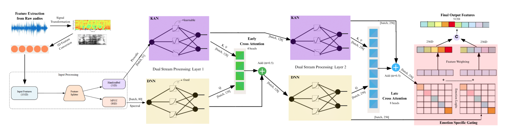

# Dual-Stream DNN-KAN for Bangla Speech Emotion Recognition

Code for our Interspeech 2026 paper:

> **Dual-Stream DNN-KAN Networks with Bangla-Specific Features for Speech Emotion Recognition**

A 1.1M-parameter dual-stream model for Bangla SER. MFCCs go through factorized
DNN blocks, statistically selected prosodic features go through lightweight
shared-basis Kolmogorov-Arnold Networks, the two streams talk through early and
late cross-attention, and an emotion-adaptive gate weights the streams per
emotion. Achieves **92.12%** speaker-independent accuracy on SUBESCO and
**82.79%** on BanglaSER, matching SSL models 23-300x larger (emotion2vec,
wav2vec2-xlsr) without any data augmentation.



## Why speaker-independent?

Most published Bangla SER numbers are speaker-dependent: clips from the same
speaker land in both train and test, so models partly memorize voices instead
of learning emotion. We report SI as the primary metric everywhere (no speaker
overlap between splits) and keep SD numbers only as a reference against prior
work. If you build on this repo, please do the same.

## Setup

Tested with Python 3.10+.

```bash
git clone https://github.com/<your-username>/bangla-ser-dnn-kan.git
cd bangla-ser-dnn-kan

python -m venv .venv
source .venv/bin/activate        # windows: .venv\Scripts\activate

pip install -r requirements.txt
```

## Datasets

None of the audio is redistributed here, grab them from the sources below and
point `config.py` (or the `--data_dir` flag) at the unzipped folders.

| Dataset | Lang | Classes | Where |
|---|---|---|---|
| SUBESCO | Bangla | 7 | [Kaggle](https://www.kaggle.com/datasets/sushmit0109/subescobangla-speech-emotion-dataset) / [paper](https://doi.org/10.1371/journal.pone.0250173) |
| BanglaSER | Bangla | 6 | [Mendeley Data](https://data.mendeley.com/datasets/t9h6p943xy) / [paper](https://doi.org/10.1016/j.dib.2022.108091) |
| RAVDESS | English | 8 | [Kaggle](https://www.kaggle.com/datasets/uwrfkaggler/ravdess-emotional-speech-audio) |
| EmoDB | German | 7 | [Kaggle](https://www.kaggle.com/datasets/piyushagni5/berlin-database-of-emotional-speech-emodb) |
| EMOVO | Italian | 7 | [official page](http://voice.fub.it/activities/corpora/emovo/index.html) |

Kaggle mirrors occasionally rename files. The label parsers live in
`utils/data.py`, fix them there if your copy looks different (the scripts will
print how many files they skipped, so you'll notice).

## Usage

The pipeline is three steps: extract features once, (optionally) re-run feature
selection, then train.

```bash
# 1. extract + cache features (slow-ish, pyin dominates. run once per dataset)
python extract_features.py --dataset subesco --data_dir /path/to/SUBESCO

# 2. train, speaker-independent (the default and the number that matters)
python train.py --dataset subesco --split si

# speaker-dependent, for comparison against older papers only
python train.py --dataset subesco --split sd

# speaker-wise 5-fold CV (the 92.07 +/- 0.91 stability check)
python train.py --dataset subesco --split cv

# 3. evaluate: per-class accuracy + confusion matrix + McNemar vs another model
python evaluate.py --dataset subesco --ckpt checkpoints/subesco_si.pt
python evaluate.py --dataset subesco --ckpt checkpoints/subesco_si.pt --compare correct_baseline.npy
```

Re-running the eta-squared selection (e.g. to adapt the pipeline to a new
corpus, like the EmoDB-retrained row in Table 3):

```bash
python select_features.py --dataset emodb
# prints ranked eta^2 table, paste survivors into SELECTED_FEATURES in config.py
```

## Repo layout

```
config.py               dataset paths, emotion maps, hyperparams, the 15 selected features
extract_features.py     wav -> cached 80d spectral + 51d prosodic vectors
select_features.py      eta-squared / ANOVA feature ranking (eq 1)
train.py                training loop, SI / SD / CV splits
evaluate.py             per-class report, confusion matrix, McNemar test
models/
  blocks.py             factorized DNN block (eq 2)
  kan.py                shared B-spline KAN layer (eq 3)
  attention.py          bidirectional cross-attention (0.5 residual)
  network.py            full dual-stream model + emotion gating (eq 4)
utils/
  audio.py              feature computation (librosa)
  data.py               per-corpus filename/label parsing
  splits.py             SI, SD, speaker k-fold
```

## Results (speaker-independent)

| Model | Params | SUBESCO | BanglaSER |
|---|---|---|---|
| CNN-LSTM (our reimpl.) | 6.9M | 88.31 | - |
| emotion2vec | 25M | 89.42 | 80.41 |
| wav2vec2-xlsr | 326M | 91.05 | 85.17 |
| **Ours (DNN-KAN)** | **1.1M** | **92.12** | 82.79 |

No augmentation used anywhere. SD numbers and cross-dataset results
(RAVDESS / EMOVO / EmoDB) are in the paper, Tables 2 and 3.

## Notes / gotchas

- Training defaults follow the paper: AdamW, lr 5e-4, weight decay 0.015,
  dropout 0.3, batch 16, max 200 epochs with patience 50, cross-entropy with
  label smoothing 0.1, seed 42.
- Prosodic features are minmax-normalized to [-1, 1] before the KAN (the
  spline grid lives on that range). Stats are fit on train only.
- The HNR here is an HPSS-based approximation, not praat's. Swap in
  parselmouth if you need the exact value, rankings barely change.
- pyin makes extraction slow (~1-2s/clip on cpu). Cached features land in
  `features_cache/` so it's a one-time cost.
- Exact accuracy can wobble a bit (+/- 1%) across hardware/library versions
  even with the seed fixed, that's normal.

## Citation

```bibtex
@inproceedings{dnnkan2026bangla,
  title     = {Dual-Stream DNN-KAN Networks with Bangla-Specific Features for Speech Emotion Recognition},
  author    = {...},
  booktitle = {Proc. Interspeech 2026},
  year      = {2026}
}
```

## License

MIT for the code. The datasets keep their own licenses, check each source.
